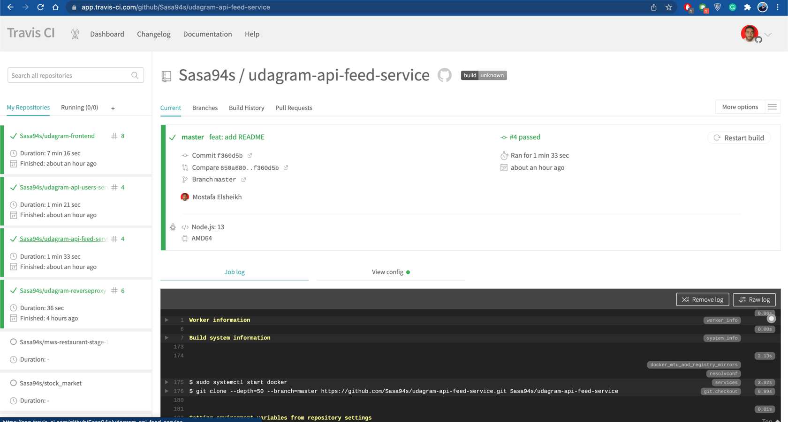
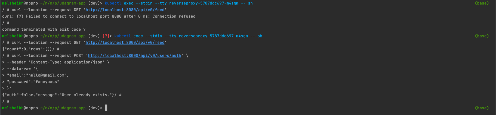

# Screenshots
To help review the infrastructure, please check the following screenshots in this directory:

## Deployment Pipeline
* DockerHub showing containers that you have pushed
* GitHub repository’s settings showing your Travis webhook (can be found in Settings - Webhook)
* Travis CI showing a successful build and deploy job

## Travis CI
* To verify Successful build and deploy jobs in Travis CI


<details>
    <summary>Click here to show screenshots</summary>




</details>

## Docker
* To verify Docker images pushed to Docker Hub registry


## Kubernetes
* To verify Kubernetes deployments are created
```bash
kubectl get deployments
```

* To verify Kubernetes pods are deployed properly
```bash
kubectl get pods
```

* To verify Kubernetes services are properly set up
```bash
kubectl get services 
```

```bash
kubectl describe services
```
<details>
    <summary>Click here to show screenshots</summary>


</details>

* To verify reverse proxy working as expected
```bash
curl --location --request GET 'http://a3d585197e2a64e86bd7eed6d122d3c2-220395696.us-east-1.elb.amazonaws.com:8080/api/v0/feed'
curl --location --request POST 'http://a3d585197e2a64e86bd7eed6d122d3c2-220395696.us-east-1.elb.amazonaws.com:8000/api/v0/users/auth' \
--header 'Content-Type: application/json' \
--data-raw '{
	"email":"hello@gmail.com",
	"password":"fancypass"
}'
```


* To verify that you have horizontal scaling set against CPU usage
```bash
kubectl describe hpa
```

* To verify that you have set up logging with a backend application
```bash
kubectl logs {pod_name}
```
<details>
    <summary>Click here to show screenshots</summary>


</details>
